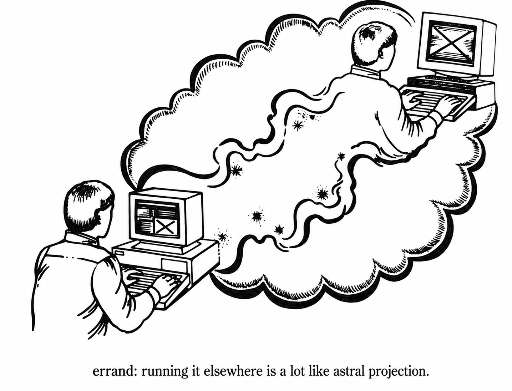

# errand

Run the thing you would have run locally, on another machine you own, and
get the result back: same command, same working tree, logs streaming to
your terminal, real exit code. The heat, watts, and minutes are spent
elsewhere.

<p align="center">
  
</p>

<p align="center"><sub>Adapted from Figure 7.1 in Daniel P. Dern's <i>The Internet Guide for New Users</i> (1994).</sub></p>

> **Status: milestone 4.5.** The transactional core works end to end over a
> tailnet, including durable detached jobs, restart reconciliation,
> content-addressed snapshot reuse, conflict-safe workspace change capture, and
> attached TCP forwarding. The v0 design is in [docs/DESIGN.md](docs/DESIGN.md).

## Installation

Release archives and Homebrew packaging are prepared; the first release and
tap publication are pending. For now, build with Go 1.27 or newer:

```sh
go build -trimpath -o errand ./cmd/errand
./errand version
```

The release pipeline produces macOS/Linux downloads for amd64 and arm64,
checksums, and a Homebrew source formula. See [releasing](docs/RELEASING.md)
for validation, publication, and runner upgrade instructions.

## Quickstart

```
# on a runner
errand setup                  # discovers tailscaled, writes errandd.toml granting
                              # this node's own login access, installs and probes
errand serve                  # what the service runs; config: ~/.config/errand/errandd.toml

# on a caller
errand peers discover         # runners on your tailnet that admit you, with exact add commands
errand peers add cabal cabal  # verify it answers you, then record it (first peer becomes default)
errand peers                  # human-readable facts from every configured peer
errand peers --json           # the same facts for scripts and agents
errand -- python3 -m unittest # runs your working tree over there
errand --apply -- gofmt -w .  # applies retained changes only after clean success
errand --no-snapshot -- uname -a # runs in a fresh empty remote workspace
errand --forward 3000 -- pnpm dev # localhost:3000 reaches remote port 3000
# Ctrl-D detaches without stopping the remote job; Ctrl-C interrupts it
job=$(errand --detach -- make build)
edit=$(errand --detach --apply -- sh -c 'printf fixed > report.txt')
errand ps                     # active jobs across configured peers
errand ps --last 20           # latest jobs across all states (maximum 200)
errand ps --all --json        # terminal receipt data for clients
errand attach "$job"          # replay logs and follow to completion
errand attach --forward 8080:3000 "$job" # add a forward while attached
errand gc jobs --dry-run --older-than 30d --keep 500
```

Frequent execution flags follow familiar CLI conventions: `-d` is
`--detach`, `-e` is `--env`, `-w` is `--workdir`, and SSH-style `-L` is
`--forward`. `errand kill -f` requests `--force`, and GC accepts `-n` for
`--dry-run`; setup and peer mutation use the same `-f` and `-n` forms, while
peer discovery uses `-a` for `--all`. Safety boundaries, transport details,
and mutating workspace options remain long-form so their meaning stays explicit.
Use `--help` at the relevant level, for example `errand peers --help` or
`errand gc jobs --help`.

`errand peers` shows runner status, capacity, platform, and capabilities. `errand peers
add NAME HOST` probes the runner with an authenticated `/v0/info` *before*
writing anything: a 403 prints your tailnet login and tells you to add it to
the runner's `allow_users`, then restart through `errand setup`; an unreachable
host suggests running setup there (or `--no-verify` to record an offline runner). HOST may be a
MagicDNS name, `host:port`, an `http://` URL, or an ssh_config host with
`--ssh` (plus `--remote-command` when errand is not on that host's login
PATH, and `--remote-socket` for a non-default daemon socket). `errand peers
discover` is read-only and scoped to your own tailnet:
it asks tailscaled for the node list, probes each online node's errand
port, and prints exact `peers add` commands for runners that admit you,
flagging ones already configured (by name or IP) and ones that refused you.
It never scans arbitrary hosts and never writes config.
Use `errand peers --on NAME` or `--url URL` to query one runner.
`errand peers --json` always returns an array of peer records, including
`name`, `target`, `default`, and `status`. Reachable peers include the complete
runner response under `info`, including CPU count, version, capacity, and tool
paths. Failed peers remain in the array with a `detail` message and no `info`.
The command exits nonzero if any selected peer cannot be queried.

`errand setup` is idempotent: it keeps an existing config or service
definition unless `--force` is given, enables user-service linger on Linux
(so the runner survives logout), installs a launch agent on macOS, and
restarts the service so preserved configuration edits are active. Before
writing anything, it reserves an idle runner and blocks new admissions until
restart; it refuses while jobs are staging, starting, running, or queued.
Generated services retain the absolute entries from the setup shell's `PATH`
and add the standard system directories, so runner-installed developer tools
remain available to jobs. Setup also links `/usr/local/bin/errand` when it can
(so SSH callers find it on the non-interactive PATH); otherwise its client
snippet includes the required absolute `remote_command`. It then probes the
daemon over its own socket. `-n` or `--dry-run` shows every decision;
`--print-acl` emits the tailnet grant for capability-based fleets.

Runner access can use a tailnet URL or SSH. Tailnet callers are authorized by
WhoIs identity through an ACL app capability or `allow_users`; an allow-listed
login receives full runner access. The daemon uses
a tailscaled LocalAPI socket when available and falls back to the `tailscale`
CLI, including for the standalone macOS app. CLI-based WhoIs cannot provide
destination-scoped capabilities, so that path requires `allow_users`.

Manage the saved allowlist locally on the runner:

```sh
errand access
errand access add -n friend@example.com
errand access add friend@example.com
errand access remove friend@example.com
errand setup                         # restart to activate saved changes
```

Use `--config PATH` before the login for a custom runner config, and pass the
same path to `setup`. `--json` is available on all access commands. These
commands edit an existing local file; they do not contact or restart a peer.
Removing an entry does not revoke capability grants or SSH access. Real edits
preserve other TOML setting values but reformat the file and remove comments.
See [runner access configuration](docs/CONFIGURATION.md#runner-access) for the
full contract.

Diagnose the runner selected for your next invocation with `errand doctor`,
or choose one with `errand doctor --on cabal`. It resolves the same run
settings as `errand config`, then checks runner connectivity, access to info,
and protocol compatibility. Failures include next steps; busy runners produce
a warning. `--profile NAME` and `--json` are supported. Doctor submits no job
and makes no configuration changes. See [doctor checks](docs/CONFIGURATION.md#diagnose-the-selected-runner)
for scope and exit codes.

Profiles can also shorten commands that need explicit environment settings:

```toml
# .errand.toml
[profiles.integration.env]
set = { CI = "1" }
pass = ["NODE_AUTH_TOKEN"]
```

Run `errand --profile integration -- pnpm test:local`. Forwarded variables
must be set in the initiating shell; diagnostics show availability without
values. Store secret names, never secret values, in the profile. See
[environment settings](docs/CONFIGURATION.md#environment-settings) for
precedence, overrides, and clearing inherited forwarding.

An SSH peer uses the same HTTP protocol over `ssh HOST errand _stdio`. The
daemon accepts the bridge through a private Unix socket and verifies that it
runs as the daemon's OS user. Configure an ssh_config alias and an absolute
binary path when non-interactive SSH does not include Errand on `PATH`:

```toml
[peers.cabal]
ssh = "cabal"
remote_command = "/usr/local/bin/errand"
remote_socket = "/srv/errand/errand.sock"
```

`errand setup` always prints the effective `remote_socket`, so the SSH peer
remains correct when setup uses a custom config, state directory, or socket.
Set `listen = "none"` in `errandd.toml` for an SSH-only runner. SSH handles
host authentication, keys, jump hosts, and caller access. Jobs submitted over
SSH and the tailnet have separate owners.
Runners execute one job at a time by default and queue up to eight more. Set
`max_jobs` and `max_queued` in `errandd.toml` to change those limits;
`max_queued = 0` disables queueing.

Run errand from a Git worktree for automatic snapshot selection. A non-Git
directory requires an explicit `.errandignore` policy or `--include-all`.
Errand always refuses a filesystem root, and snapshotting your home directory
requires `--include-all`. The client prints the selected file count and byte
total before remote admission. Use `--no-snapshot` when a command needs no
local files; Errand then skips local content inspection and runs it in an empty
remote workspace. Errand still records the invocation directory's identity so
retained changes can be applied there safely. Because the remote workspace is
empty, `--workdir` may only name its root.

For a workspace containing several repositories, place this marker and an
explicit `.errandignore` at the shared root:

```toml
# .errand.toml
[workspace]
root = true

[run]
peer = "mac-mini"             # optional; alias lives in personal config

[changes]
apply_on_success = true
```

Errand discovers the nearest marked ancestor, snapshots from there, and runs
the command in the caller's relative directory. `--workspace-root PATH`
selects the same boundary explicitly. Automatic discovery trusts only a marker
and directory owned by the caller in a directory that is not group- or
world-writable; use the explicit flag for intentionally shared workspaces. A
marker chooses only the boundary; it does not bypass `.errandignore`, Git
selection, home-directory protection, or the filesystem-root refusal.
`[changes].apply_on_success` is read only from the selected workspace root.
For `--no-snapshot`, the current directory is the configuration root; Errand
does not climb to an ancestor marker when no local workspace is transferred.
Set `apply_on_success = true` in `~/.config/errand/config.toml` for a personal
default. Explicit `--apply` or `--no-apply` wins over workspace and personal
configuration. Applying is a property of the submitted job, independent of
whether its logs are currently being observed. `--detach --apply` and Ctrl-D
during an applying run hand completion to a detached local worker, which waits
for success and applies into the originating workspace. `attach` remains
observation-only and never chooses or changes that policy. If the worker or
client machine stops, the persisted policy is resumed by the next client
command on that machine.

`[run].peer` chooses a preferred configured peer for new runs. `--on` or
`--url` wins over this preference; an unknown workspace alias fails instead
of silently using the personal default. `errand config` shows the effective
run settings and their sources; `errand config --json` provides the same
information for scripts. Inspection stays local and does not resume automatic
applications. Named profiles in personal or workspace config can supply peer,
workdir, and apply preferences: `errand --profile build -- go test ./...`.
CLI flags override profiles; `errand config --profile build` explains the
result. See [configuration](docs/CONFIGURATION.md) for syntax and precedence.

## Why not just ssh?

ssh gives you a remote shell and assumes the remote already has your
project state: a checkout on the right branch, your uncommitted changes,
no stale artifacts. Every ssh target is a pet you maintain.

errand ships the workspace *with* the job, so targets are stateless with
respect to your projects: nothing checked out, nothing drifting, any peer
equally valid at any moment. Around that round-trip it wraps a
transaction ssh doesn't attempt. The implemented milestones provide:

- **At-most-once admission:** network retries cannot run a command
  twice.
- **Durable execution:** an admitted job survives caller disconnect, with
  ordered logs that the protocol can resume after a dropped connection.
- **Honest cleanup:** errand removes the temporary workspace and inherited
  process scope it owns, then records whether cleanup completed.
- **A receipt:** an append-only record of what was asked, who asked, what
  ran, and what happened.

The remaining v0 work includes explicitly declared named caches and
fact-based peer selection.

## Shape

One binary, symmetric peers, no controller. Transport and identity come from
your [tailnet](https://tailscale.com) or SSH. The current execution backend
runs directly on the host. Rootless containers and Nix devshells are planned.
Symmetry means that each machine can send work to other peers and receive work
from them. Errand rejects a tailnet client connection to a runner on the same
machine; SSH reaches the daemon through its private local socket.

```
errand -- cargo test                   # configured default peer
errand --on buildbox -- cargo test     # named configured peer
```

An attached terminal can detach at any time with Ctrl-D and later resume with
`errand attach HANDLE`. Ctrl-C keeps its Unix meaning: it sends SIGINT to the
remote command, and a second Ctrl-C force-kills it. Interactive detachment
returns 0 for the detach action; it is not the unfinished job's exit status.
Non-terminal EOF is ignored, so scripts remain attached unless they request
`--detach` explicitly.

`--forward [LOCAL:]REMOTE` opens TCP listeners on IPv4 and IPv6 local loopback for the
attached session. It is repeatable and can be added when initially running a
job or on any later `attach`. Omitting `LOCAL` uses the remote port locally.
Ctrl-D closes the attachment's listeners and active connections without
stopping the job. Forwarding is not remembered, and `--detach --forward` is
rejected because no attached client would remain to own the listener. Host
jobs share the runner's loopback network, so Errand cannot prove that a
listening service belongs to the selected host job. Capability-based runners
require the separate `forward-own` action. Forwarded connections carry bytes
in both directions while open; EOF or reset on either side closes that
connection.

Detached jobs, `ps`, `attach`, `kill`, workspace-root discovery, automatic
workspace change capture and conflict-safe application, TCP forwarding,
snapshot caching, fleet storage reporting, and cache and receipt GC are
implemented. Planned v0 commands still include fact-based peer selection and
named-cache management.

After every command, Errand compares the final remote workspace with the
submitted snapshot and retains every snapshot-representable created, modified,
or deleted path. No declaration is required. Every submitted path is compared.
New paths are retained only when allowed by the ignore policy frozen during
snapshot selection, so a remote command cannot widen retention by rewriting
`.errandignore` or `.gitignore`. Git metadata, Errand apply transactions, and
transient filesystem nodes such as sockets are excluded.
Failed commands retain their changes too,
which makes reports, traces, and partial build products available for
inspection. A `--no-snapshot` job starts from an empty baseline, so every file
it creates is retained.

A run reports retained changes and the job handle but does not download them
unless `--apply` or `apply_on_success` requests automatic application after a
completely successful transaction. The policy survives explicit `--detach`
and interactive Ctrl-D; failed commands never apply automatically. The
originating client records background application progress and errors, which
`errand status HANDLE` reports alongside the changed paths. `errand attach
HANDLE` follows logs and status only; it never downloads or applies workspace
changes. `errand fetch HANDLE [PATH]`
stages all changes or any retained path. Applying a selected path requires a
retained change root or an ancestor of one; `errand fetch --apply HANDLE [PATH]`
performs a three-way merge from the submitted snapshot, the current local
workspace, and the completed remote workspace. Errand applies the result only
when the entire selected merge is clean. On conflict, the working tree remains
untouched and the staged base and remote trees remain available.
`errand fetch --apply --conflicts HANDLE [PATH]` explicitly chooses a
non-clean state: clean changes are applied, text conflicts receive standard
conflict markers, and binary or type conflicts keep their local values. It
exits nonzero, reports unresolved paths, and keeps the base and remote values
in staging for manual resolution. Deletions use the same merge rules;
fetching only deleted paths returns the retained `bundle.json` tombstone
metadata because no file exists to return. A different machine can fetch
and inspect changes, but cannot apply them without the originating machine's
workspace identity record. Change records are scoped by runner endpoint and
job ID, so one peer cannot reuse another peer's apply state.

Git is not required for non-Git snapshots, running jobs, status, logs, or plain
fetches. Applying changes needs `git merge-file` on the client only when both
the local and remote sides changed the same text file and a true three-way text
merge is required. Missing Git fails that apply safely before installation.

## Job state and control

Bare `errand ps` queries every explicitly configured peer, merges the results
newest-first by job ULID, and shows active jobs only. The active filter is
applied by each runner before its bounded receipt window, so retained terminal
jobs cannot hide a long-running job. `--all` includes terminal receipts;
`--last N` includes all states and applies one global limit after merging.
`--on` and `--url` explicitly narrow either view to one runner. Bare
`errand peers` and `errand df` follow the same all-configured-peers rule.
These read-only fleet commands share target selection, concurrent querying,
partial-failure reporting, and exit semantics. Commands that mutate runner
state remain explicitly single-runner.

Interactive terminals show wrapped job cards with complete commands. Piped or
redirected output uses a compact plain table for tools such as `grep` and
`head`. Both forms show admission and process start times, process duration,
project, source snapshot, command, and terminal outcome. `WORKDIR` appears only
when a listed job runs below its workspace root. Git sources are shown as a
short commit plus `+dirty` when applicable; `errand ps --json` retains exact
structured project, workdir, commit, and manifest metadata, including
truncation flags. Running durations are measured on the runner, so caller and
runner clock offsets do not distort them.

`errand status HANDLE` shows one job's complete human-readable execution view:
runner, state, command, timing, process and transaction outcomes, retained-log
availability, retained workspace changes, and relevant next
commands. `errand status --json HANDLE` emits the same owner-visible data as
structured JSON. `ps` remains the multi-job listing; `attach`, `fetch`, and
`kill` remain the actions on a selected job.

Client-side workspace identities, downloads, and apply transactions are
stored under `$XDG_STATE_HOME/errand`, or `~/.local/state/errand` when
`XDG_STATE_HOME` is unset. `XDG_STATE_HOME` must be absolute and can point to a
writable private location in restricted agent environments. Errand avoids
changing an already-secure directory. It attempts to tighten excess read access
but only refuses to proceed when ownership, missing owner access, or permissions
writable by another user would make the state untrustworthy.

The remote job states have deliberately narrow meanings:

- `staging`: admitted and preparing its workspace, but the command has not
  started.
- `queued`: staging is complete and the job is waiting for a running slot. Its
  process start and duration remain blank.
- `running`: the command has started and has not reached a terminal result.
- `exited`: the command reached a terminal result, including ordinary nonzero
  exits and signals forwarded to or raised by the process.
- `killed`: Errand terminated the job because of a user request or enforced
  limit.
- `ambiguous`: Errand cannot prove a clean terminal outcome, commonly after
  restart reconciliation or a receipt persistence failure. It never silently
  replays the command.

`detached` is a local attachment condition, not a remote job state. Detaching
with Ctrl-D leaves the job unchanged. Ctrl-C sends SIGINT, and a second Ctrl-C
sends SIGKILL. `errand kill HANDLE` requests graceful SIGTERM termination;
`errand kill --force HANDLE` sends SIGKILL. Staging and queued jobs can be
cancelled durably before they start. A submission is rejected as busy only
when both the configured running slots and bounded queue are full.

`errand df` reports logical storage used by each runner's shared snapshot cache
and the authenticated caller's job receipts, plus local change records and
download staging. Human output uses readable binary units; `--json` preserves
raw byte and item counts, cache limits, and cache TTL. Capability-based runners
must grant `read-own` to use `errand df`; `manage-caches` remains required only
for `errand gc cache`. Job receipt collection uses the separate `gc-own` action.
The frozen design's ACL example includes the complete action set.

GC always names its target. Bare `errand gc` only prints usage:

```text
errand gc cache
errand gc cache --dry-run
errand gc jobs --older-than 30d --keep 500
errand gc jobs --dry-run --older-than 30d
errand gc changes --older-than 30d
errand gc all --older-than 30d --keep 500
errand gc all --dry-run --older-than 30d --keep 500
```

Job GC only removes the caller's clean `exited` or `killed` receipts. Clean
means cleanup, logs, and workspace-change retention all completed with no
transaction error.
Active, queued, ambiguous, incomplete, and actively replayed receipts are
protected. When both retention bounds are present, a receipt must be older
than the cutoff and outside the newest `keep` receipts to be removed. `all` is
client-side composition of the separately authorized cache and job endpoints
plus local change-state collection. `gc changes` removes old local workspace
identity records, verified downloads, and interrupted download staging;
pending apply transactions are always protected. Records whose submission never began follow
the requested `--older-than` boundary. Unresolved submitted jobs remain
protected for 30 days, after which an explicit local GC may retire abandoned
state.
`--dry-run` is available for every GC target. It applies the same selection
policy and reports the space it can inspect without changing cache, receipt,
reconciliation, local-change, lock, permission, or admission-clock state.
Local staging that cannot be inspected without widening permissions is reported
as a failed preview and left untouched.
After non-dry job GC, the client replays the runner's durable, owner-scoped
collection markers, so a lost deletion response does not strand local records.
New job IDs must carry a ULID timestamp from the preceding 24 hours, with one
hour of allowed future clock skew. The runner durably advances a high-water
clock that never moves backward across restart. Replay-only collection markers
expire after 25 hours. Markers for jobs with retained changes are scoped to the
originating client and retain that minimum lifetime; after the client reconciles
its local state, it acknowledges the marker so it can retire. Unacknowledged
change markers expire after 30 days, bounding abandoned client state. The
markers are small and non-secret, and they never permit a collected ID to
execute again.

Linux and macOS first; Windows is a design constraint, not yet a
deliverable.

## Performance

The [performance baseline](docs/PERFORMANCE.md) records cold, cached, and
no-snapshot overhead, with a reproducible synthetic harness and local snapshot
benchmarks.

## Non-goals

Not a CI system, not interactive (no PTY in v0), not a security boundary
against hostile code, no web UI, and no arbitrary-host discovery or scheduler
fan-out. `errand ps` only queries explicitly configured peers. The design
resists becoming ansible, nomad, or a scheduler on purpose.

## License

MIT
