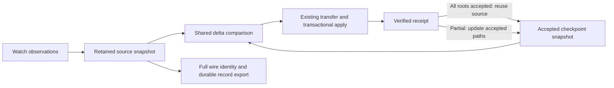

# Retained snapshot performance decision

The [review follow-up](SNAPSHOT_REVIEW_FIXES.md) removes redundant delta-record
serialization and internal copies, and defines a stricter three-variant native
comparison. The results below describe `9ee7cbd`, not that follow-up patch.

## Fixed objective

Choose by transfer latency while preserving source selection, conflict handling,
body verification, checkpoint identity and durable recovery. Memory footprint
and implementation size do not decide adoption. The earlier flat experiment
did not evaluate retained indexed comparison and does not settle this decision.

The engine retains a persistent Merkle index across watch preparation,
source comparison and successful checkpoint advancement. The control is the
flat implementation with **identical caller integration**. There is no user-facing
strategy switch. Cold one-shot snapshots do not eagerly build an unused index.
Crossover measurements select contiguous updates for inventories below 4,096
entries; larger retained inventories build the index. Validation, comparison,
export ownership, and transfer semantics remain behind the same snapshot API.

## Work removed

Previously, watch updated an index but exported it before calling push. Push
reconstructed two snapshots from complete manifests, so comparison used a linear
scan. Successful receipts then rebuilt the complete accepted-source manifest.

Now `Watch.PrepareSnapshot` returns the immutable snapshot. Push retains its
accepted checkpoint as another snapshot and calls the shared delta selection
logic directly. The Merkle implementation can skip equal subtrees. A locally
prepared comparison owns both snapshots and its canonical bundle. A receipt
accepting every changed root reuses the prepared source as the next checkpoint.
Partial receipts validate the merge bases and update only accepted paths. Recovery
of an older pending request still checks the durable bundle and checkpoint.



Full JSON identity and durable record serialization still run. Tree hashes only
accelerate internal comparison; they do not replace protocol roots. The complete
metadata benchmark includes those remaining exports instead of timing only a
cheap index update. File bodies remain whole-file content-addressed blobs.

## Measurement contract

- Use the same native runner, Go toolchain, GOMAXPROCS=2, fixtures, workload and
  command integration for both variants. Measure actual fixture filesystem.
- Alternate variant ordering over five rounds. Keep every sample and phase
  measurement, including slow observations.
- Measure retained metadata at 1K, 10K and 100K entries with 1 and 100 edits.
  Report update, comparison, acceptance and complete serialization separately.
- Check complete 10K-entry watch and push operations, ephemeral and persistent
  fetch, workspace creation and ephemeral job submission. Also retain cold/full
  reconciliation measurements. These are native loopback HTTP operations, not
  cross-machine rsync or Mutagen comparisons.
- Run the full candidate suite, vet, and race checks on manifest, snapshot,
  changes, archive and client packages on both runners. The flat control also
  passes focused manifest, changes, snapshot and client contracts locally.
- Decide from repeatable latency differences with an identifiable cause. A
  microbenchmark win alone does not establish a full watch latency win. Mixed
  or noisy results remain inconclusive rather than becoming a new architecture
  choice based on memory or line count.

The [frozen inputs](benchmarks/2026-09-13-retained-decision-inputs.tar.gz) contain
source overlays for the preceding flat candidate, the matched flat control, and
the retained Merkle candidate. Apply each overlay over `git archive 9f3708a`.
`inputs.json` records each source inventory digest. The included benchmark harness
records binary hashes and raw results.

## Remaining scope

The shared snapshot comparison is used by transfer source preparation. Retaining
the index across the watch client boundary is this experiment's integration.
Receiver checkpoint persistence, full wire identity, direct materialization and
creation/submission initialization remain the next steps in the shared engine
plan. They are not claimed as completed by this change.

## First paired result and diagnosed costs

The [first complete comparison](benchmarks/2026-09-13-retained-snapshot-decision.json)
contains five alternating pairs per host. It does not establish an end-to-end
Merkle win. For 100K entries and one edit, the complete metadata cycle was
42.01 → 46.65 ms on Mini and 154.19 → 162.35 ms on Cabal (flat → tree).
Yet Cabal's update phase fell from 5.079 ms to 0.034 ms and comparison from
2.190 ms to 0.015 ms. Full serialization consumed 162.30 ms in the tree case.
The internal improvement was real; repeatedly materializing the full wire view
consumed it. The 1K/100-edit Cabal case also lost in all five pairs, with update
cost 0.218 → 1.202 ms, exposing repeated shared-ancestor work.

Watch delivery did not show a repeatable win. Its median paired tree/flat ratio
was 1.059 on Mini and 1.052 on Cabal. The observed ranges were 0.940–1.120 and
0.925–1.113 respectively. Marginal medians alone can mislead: Mini's separate
medians decreased even though three of the five paired comparisons were slower.
Push's paired ratios were 0.965/0.974, but cold control operations varied widely.
For example Mini creation ranged from 0.700 to 3.041 times its paired control.
These observations are retained, not used to claim uniform gains or no regressions.

The next isolated candidate keeps the Merkle index and targets those measured
costs. It caches the immutable materialized wire view, derives the next view by
copying unchanged ranges when available, and does not retain chains of snapshots.
Read APIs still return owned slices. Replacement batches visit their shared
ancestor paths once; structural changes keep the existing bounded tree algorithm.
Already sorted replacement metadata uses the sorted validator.

A local three-pair diagnostic of export reuse alone reduced 10K/one-edit metadata
cycles from 6.59–6.78 ms to 6.29–6.35 ms. It is a diagnostic on the laptop, not a
runner or full-delivery claim. The follow-up compares the optimized tree against
the same flat control on both runners, using 100 iterations for smaller metadata
cases, 20 for 100K cases, and five watch cycles per sample. Five alternating pairs
also retain cold metadata and reconciliation controls. Full tests, vet and race
checks run again because the materialization implementation changed.

## Measured index cutoff

The [crossover run](benchmarks/2026-09-13-retained-crossover.json) adds 2K, 4K and
8K inventories with the same 1/100-edit workloads and five alternating pairs.
At 2K/100 edits, indexing lost every pair on both hosts: median paired ratios
were 1.145 on Mini and 1.386 on Cabal. At 4K/100 edits it won four of five pairs
on both, with ratios 0.940 and 0.866. At 8K/100 edits it won all five pairs, with
ratios 0.975 and 0.903. This supports 4,096 entries as a measured cutoff for these
workloads, not a universal mathematical optimum for every directory layout.

Small snapshots apply the same validated edit batch by copying unchanged array
ranges. Larger snapshots retain the Merkle index; replacement batches share
ancestor work, and a cached flat view serves the existing wire format. A snapshot
that already owns an index keeps it as it shrinks, avoiding representation churn;
a fresh full preparation applies the cutoff again. Both representations use the
same changed-hierarchy validation and edited-view materialization helper. There
is no second push, fetch, or workspace transfer implementation.

[CPU profiles](benchmarks/2026-09-13-retained-profile.json) of Cabal's 1K/100-edit workload show SHA256 compression accounting
for 25.1% of tree CPU samples versus 18.4% for the flat control, alongside JSON
encoding and collection work. These percentages describe separate profile runs,
not a normalized throughput comparison. The cutoff removes unnecessary index
hashing in the measured losing regime; memory size is not the selection reason.

## Adoption result and decision

Adopt the shared engine with the 4,096-entry cutoff, retained Merkle comparison,
batched replacements and cached wire materialization. This decision accepts
measured workload tradeoffs, not a universal speedup. Large sparse comparisons
remove orders of magnitude of metadata work; Cabal's complete 10K metadata cycles
also improve in every final pair. The final Mini run does not reproduce all of
the earlier complete-cycle gains. Full JSON export remains a measured limitation
and is the next optimization target before claiming broadly faster delivery.

The [final adoption run](benchmarks/2026-09-13-retained-snapshot-adoption.json)
contains five alternating pairs on native APFS and Btrfs. Values below are
separate medians in milliseconds, followed by the median of paired
candidate/control ratios. A ratio below 1 favors the adopted engine; it need not
match the ratio of the separate medians. All samples and cold controls are in
the linked result.

| Workload | Mini flat → adopted (ms) | Paired ratio | Cabal flat → adopted (ms) | Paired ratio |
|---|---:|---:|---:|---:|
| 1,000 entries, 1 edits | 0.848 → 0.890 | 1.080 | 1.591 → 1.838 | 1.083 |
| 1,000 entries, 100 edits | 0.515 → 0.537 | 1.043 | 2.332 → 2.350 | 1.184 |
| 10,000 entries, 1 edits | 4.388 → 4.219 | 0.951 | 18.785 → 17.384 | 0.919 |
| 10,000 entries, 100 edits | 4.925 → 5.008 | 1.039 | 21.533 → 17.878 | 0.852 |
| 100,000 entries, 1 edits | 41.384 → 42.273 | 1.012 | 156.825 → 156.900 | 0.996 |
| 100,000 entries, 100 edits | 43.009 → 44.686 | 1.031 | 158.395 → 154.106 | 0.960 |
| Complete watch cycle, 10K entries | 375.949 → 380.081 | 1.014 | 564.008 → 547.032 | 0.944 |

For 100K entries and one edit, update plus comparison falls from about 2.226 ms
to 0.018 ms on Mini and 7.234 ms to 0.061 ms on Cabal. Those phase improvements
do not guarantee a complete-cycle win: Mini's wire phase increases from 39.279
to 42.254 ms in this run. The final 1K/100-edit case is also slower overall,
despite removal of its earlier Merkle hashing penalty. These losses are retained
in the decision record; the cutoff does not eliminate every source of overhead.

Complete watch remains approximately 380 ms on Mini and 547 ms on Cabal in this
fixture. Mini wins only two of five final pairs; Cabal wins four. That supports
a modest Cabal improvement and no established Mini improvement. It does not
meet the near-instant goal. Cold and reconciliation controls are mixed, including
slower cases. The final run is focused on affected retained paths; the earlier
broad run covers push, fetch, creation and submission, and is not a final-version
performance guarantee for those operations.

The measured candidate passes the full Go suite, vet and race checks for
manifest, snapshot, changes, archive and client on both hosts. Source and binary
digests, filesystem identification, raw logs and frozen inputs are retained.

## Reproduction and verification scope

The [adoption inputs](benchmarks/2026-09-13-retained-adoption-inputs.tar.gz)
contain the measured candidate and flat control as overlays over `git archive
9f3708a`. The [crossover inputs](benchmarks/2026-09-13-retained-crossover-inputs.tar.gz)
preserve the separate cutoff experiment. Every overlay has been reconstructed
and checked against its recorded source digest. Exact historical harnesses are
embedded in the raw result files and included in the source overlays.

The current harness exposes the same focused workload as `--scope retained`:

```sh
python3 scripts/benchmark_snapshot_integration.py \
  --baseline /path/to/reconstructed/baseline \
  --output ./snapshot-adoption-results \
  --revision "$(git rev-parse HEAD)" \
  --scope retained --rounds 5
```

Omit `--scope retained` to include complete push, both fetch modes, creation and
submission again. The baseline must include the retained snapshot API and
benchmarks; use the frozen control above rather than an arbitrary old commit.

The final benchmarked production Go source matches the adopted implementation
byte-for-byte. After freezing the benchmark input, tree-specific test fixtures
were adjusted to keep exercising indexed paths above or independent of the new
cutoff. The final manifest race suite passed locally with those additional
coverage checks. No production code changed after the measurement was frozen.
