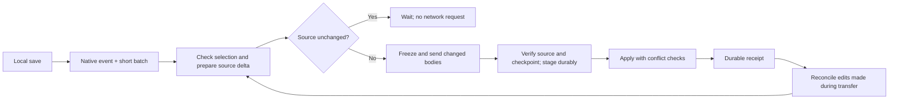

# Watch and shared transfers: implementation checkpoint

Watch now drives the existing push transaction from native filesystem events.
The performance work removes repeated source preparation and unnecessary body
transfers while preserving conflict checks and recovery.

```sh
errand push --watch --apply --profile dev
```

`--watch` repeats push; `--apply` changes the remote workspace. Without `--apply`,
watch stages only. Ctrl-C drains the active transfer and leaves the remote
application running. Application watchers can hot reload after file delivery;
Errand's receipt does not certify application readiness.

## From save to receipt



Native kqueue notifications on macOS and inotify on Linux replace repeated idle
polling. Saves use a 5 ms quiet period capped at 25 ms. One transfer runs at a
time, with later edits queued. Conflicts stop watch; `--conflicts` applies clean
changes and eligible text markers before stopping. Lost apply replies recover
the original request before a new request can replace it.

## Where the work is reused

| Operation | Preparation and transfer | Completion |
|---|---|---|
| Watch | Reuse selection evidence and hashes; refresh changed files; send source delta | Shared staging, conflict checks and apply receipt |
| Push | Fresh source selection; send source delta against retained checkpoint | Same staging and apply path |
| Fetch | Reconstruct the job's observed source; materialize only changed bodies | Same prepared-source staging and local apply engine |
| Create workspace / submit job | Keep a full logical snapshot; upload bodies missing from the verified cache | Existing workspace creation or job admission |

Creation and submission share body caching, not persistent transfer checkpoints.
Each direction's checkpoint describes accepted source content, never arbitrary
live destination files.

## How this reduces latency

- **Less scanning:** explicit `.errandignore` selections can refresh hinted files
  using fresh policy bytes and directory identity/timestamp evidence. Hash reuse
  checks file identity, size, mode, mtime and ctime. Known dirty files always lose
  their cached hashes. Git selection and structural/atomic changes still use full
  reconciliation.
- **Less transfer:** push freezes and uploads changed source bodies and compact
  delta metadata. Deltas with at most 64 KiB of bodies skip cache negotiation;
  larger uploads and initial snapshots can reuse verified cached bodies.
- **Less repeated metadata work:** owned, validated source plans are reused by
  staging. Watch accepts the prepared delta after its receipt instead of
  recomputing it. Sorted manifests use indexed lookup and ordered merging.
- **Shorter lock ownership:** receiver source expansion happens outside the
  workspace apply lock; checkpoint validation still happens inside it.
- **Reuse native storage optimizations:** this builds on the preceding APFS
  `clonefile` and Linux reflink/copy fallbacks and extends batched staging flushes
  to bundle members. Durable publication barriers remain.

An ordinary push also publishes a local generation token under the checkout
lock. A live watch checks it before suppressing an unchanged source. This closes
the case where another command pushed B while watch remembered A, then the local
file returned to A. The token is advisory; durable pending requests and remote
receipts still own crash recovery.

The review fixes also close a watcher-registration gap, verify selection before
cache fingerprints leave the client, and reject stale unstarted-stage retries.
Regression coverage includes each case.

## Remaining costs

Full manifests, staging records, apply journals and durable barriers still cost
time. Git selection and atomic editor saves still cause full reconciliation.
Retained attempt history still has a 4096-attempt bound and growing scan costs.
This checkpoint does not add automatic retention or claim long-session stability.

Measured file delivery and the final durable receipt are separate milestones.
Mutagen's destination delivery and rsync's command completion are useful
comparators, but do not prove equivalent conflict or crash-recovery guarantees.

See [the final benchmark round](TRANSFER_FINAL_BENCHMARKS.md),
[the preceding implementation measurements](TRANSFER_PERFORMANCE.md), and
[the review fixes](TRANSFER_REVIEW_FIXES.md).
